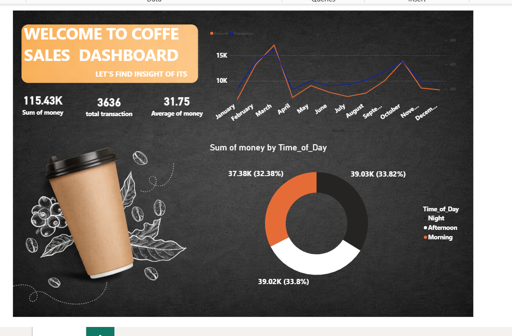
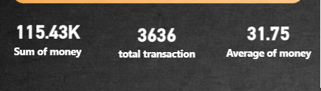
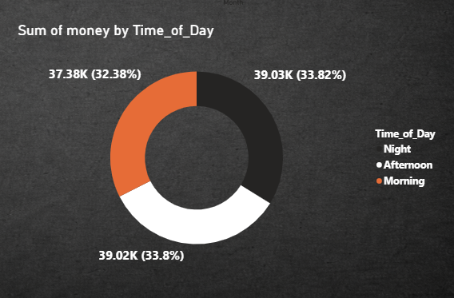

# ☕ Coffee Sales Dashboard (Power BI)

A visually interactive **Power BI Dashboard** built to analyze coffee sales data and generate business insights. This dashboard helps understand sales trends, customer purchasing behavior, transaction patterns, and revenue distribution across different times of the day.

---

## 📌 Project Overview

This project demonstrates how Power BI can transform raw sales data into meaningful business insights using:

- Interactive visualizations
- KPI Cards
- DAX Measures
- Time-based Analysis
- Business Performance Tracking

The dashboard is designed with a coffee-themed UI to make analytics more engaging and user-friendly.

---

## 📷 Dashboard Preview



---

## 📊 Key Performance Indicators (KPIs)

| KPI | Value |
|------|------:|
| 💰 Total Sales | **115.43K** |
| 🧾 Total Transactions | **3,636** |
| 📈 Average Sale Amount | **31.75** |

---

## 📈 Dashboard Features

### 📅 Monthly Sales Trend
- Tracks monthly revenue throughout the year.
- Compares:
  - Total Sales
  - Number of Transactions
- Helps identify seasonal trends and peak sales months.

---

### 💰 KPI Cards
Displays important business metrics:

- Total Revenue
- Total Transactions
- Average Revenue per Transaction

---

### 🌅 Sales by Time of Day

Analyzes sales distribution across:

- 🌞 Morning
- 🌤 Afternoon
- 🌙 Night

Useful for identifying peak business hours.

---

## 📁 Project Structure

```
Coffee-Sales-Dashboard/
│
├── coffee dashb.pbix              # Power BI Dashboard
├── Coffe_sales.xlsx               # Dataset
├── dashboard-overview.png         # Dashboard Screenshot
├── kpi.png                        # KPI Preview
├── sum-of-money.png               # Additional Visualization
└── README.md
```

---

## 🛠 Tools & Technologies

- Power BI Desktop
- Microsoft Excel
- Power Query
- DAX (Data Analysis Expressions)

---

## 📂 Dataset

The dataset contains coffee sales transaction information including:

- Transaction Date
- Sales Amount
- Product Details
- Transaction Count
- Time of Day
- Monthly Sales Data

---

## 📊 Insights Generated

✔ Monthly sales performance

✔ Peak sales months

✔ Total revenue generated

✔ Average transaction value

✔ Transaction volume

✔ Revenue distribution by time of day

---

## 🚀 How to Use

1. Clone this repository

```bash
git clone https://github.com/your-username/Coffee-Sales-Dashboard.git
```

2. Open **coffee dashb.pbix** in Power BI Desktop.

3. If required, reconnect the data source to **Coffe_sales.xlsx**.

4. Refresh the report to view updated insights.

---

## 📸 Additional Screenshots

### KPI Cards



---

### Revenue Analysis



---

## 🎯 Learning Outcomes

Through this project, I practiced:

- Power BI Dashboard Design
- Data Cleaning using Power Query
- Creating DAX Measures
- KPI Development
- Interactive Report Building
- Data Visualization Best Practices

---

## 📌 Future Improvements

- Add dynamic filters and slicers
- Product-wise sales analysis
- Customer segmentation
- Profit analysis
- Geographic sales visualization
- Forecasting using Power BI Analytics

---

## 👨‍💻 Author

**Mani**

If you found this project useful, feel free to ⭐ this repository.

---

## 📄 License

This project is for educational and portfolio purposes.