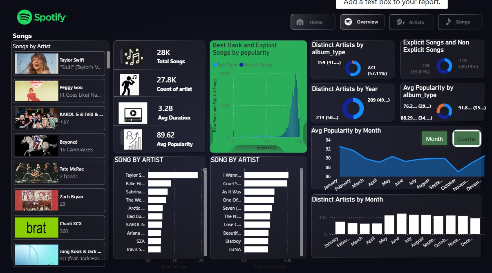
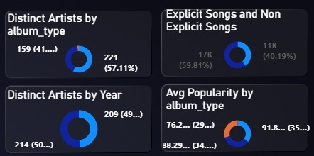

# 🎵 Spotify Top 50 World Dashboard (Power BI)

An interactive **Power BI Dashboard** built to analyze the **Spotify Top 50 World Songs** dataset. This project provides insights into song popularity, artists, album types, track duration, release trends, and overall streaming performance through visually appealing and interactive reports.

---

## 📌 Project Overview

This dashboard transforms raw Spotify data into meaningful business and music analytics using Power BI. It enables users to explore song performance, identify popular artists, understand music trends, and make data-driven observations.

---

## 📷 Dashboard Preview



---

## 📊 Key Features

- 📈 Interactive KPI Cards
- 🎵 Song Popularity Analysis
- 🎤 Artist Performance
- 💿 Album Type Distribution
- 📅 Release Date Analysis
- 📊 Area & Cluster Charts
- Dynamic Filtering and Exploration

---

## 📈 Key Performance Indicators (KPIs)

The dashboard highlights important metrics such as:

- 🎶 Total Songs
- ⭐ Average Popularity Score
- 👨‍🎤 Total Artists
- 💿 Album Types
- ⏱ Average Track Duration
- 🔞 Explicit vs Non-Explicit Songs

*(Refer to the KPI dashboard below.)*

---

## 📂 Project Structure

```
Spotify-Top-50-World-Dashboard/
│
├── spotify D.pbix
├── spotify-top-50-world (1).xlsx
├── DASHBOARD-OVERVIEW.png
├── KPI.png
├── AREA AND CLUSTER.png
└── README.md
```

---

## 🛠 Tools & Technologies

- Power BI Desktop
- Microsoft Excel
- Power Query
- DAX (Data Analysis Expressions)

---

## 📂 Dataset

The dataset includes information about Spotify's Top 50 World tracks, including:

- Song Name
- Artist
- Popularity
- Duration (ms)
- Album Type
- Total Tracks
- Release Date
- Explicit Content
- Position

---

## 📊 Insights Generated

This dashboard helps answer questions such as:

- Which songs have the highest popularity?
- Which artists appear most frequently in the Top 50?
- How are songs distributed across different album types?
- What is the average duration of Top 50 songs?
- How many songs contain explicit content?
- How have releases varied over time?

---

## 🚀 Dashboard Components

### 📊 KPI Dashboard

Displays important business metrics at a glance.



---

### 📈 Area & Cluster Analysis

Visualizes trends and comparisons across different metrics for deeper analysis.


---

## 🚀 How to Use

1. Clone this repository:

```bash
git clone https://github.com/your-username/Spotify-Top-50-World-Dashboard.git
```

2. Open **spotify D.pbix** using **Power BI Desktop**.

3. If prompted, reconnect the dataset to:

```
spotify-top-50-world (1).xlsx
```

4. Refresh the report to view the latest dashboard.

---

## 📚 Skills Demonstrated

This project showcases proficiency in:

- Data Cleaning with Power Query
- Data Modeling
- DAX Measures & Calculations
- Interactive Dashboard Design
- Data Visualization
- Business Intelligence Reporting
- Analytical Storytelling

---

## 🎯 Learning Outcomes

Through this project, I gained experience in:

- Designing professional Power BI dashboards
- Creating meaningful KPIs
- Building interactive reports
- Performing trend analysis
- Presenting insights through effective visualizations

---

## 🔮 Future Improvements

- Add genre-based analysis
- Country-wise streaming insights
- Artist ranking dashboard
- Monthly popularity trends
- Forecasting future song popularity
- Spotify API integration for live data

---

## 👨‍💻 Author

**Mani**

If you found this project helpful or interesting, feel free to ⭐ this repository.

---

## 📄 License

This project is intended for educational and portfolio purposes.